# Awesome 3D Generation 
> 🎯 A curated list of papers on 3D generation with visual previews - see research at a glance.

> üåü Papers are organized by different 3D representations: Mesh, SDF (Signed Distance Function), Point Cloud, NeRF, and more.

> üìö We also include papers that, while not strictly about generation, demonstrate valuable techniques and insights for 3D generation research.

> 🏠 You can also check our [Project Homepage](https://awesome3dgen.com/).

üî•üî•üî• Also check out our awesome list about [Neural CAD](https://github.com/BunnySoCrazy/Awesome-Neural-CAD).

## Mesh

| Preview | Title | Publication | Links |
|:---:|:---|:---:|:---:|
|  | QuadGPT: Native Quadrilateral Mesh Generation with Autoregressive Models | arXiv 2025 | [Paper](https://arxiv.org/pdf/2509.21420) |
|  | ARMesh: Autoregressive Mesh Generation via Next-Level-of-Detail Prediction | arXiv 2025 | [Paper](https://arxiv.org/pdf/2509.20824)   [Project](https://jblei.site/proj/armesh) |
|  | MeshCoder: LLM-Powered Structured Mesh Code Generation from Point Clouds | arXiv 2025 | [Paper](https://arxiv.org/pdf/2508.14879)   [Project](https://daibingquan.github.io/MeshCoder/)   [Code](https://github.com/InternRobotics/MeshCoder) |
|  | VertexRegen: Mesh Generation with Continuous Level of Detail | arXiv 2025 | [Paper](https://arxiv.org/pdf/2508.09062)   [Project](https://vertexregen.github.io/) |
|  | FastMesh: Efficient Artistic Mesh Generation via Component Decoupling | arXiv 2025 | [Paper](https://arxiv.org/pdf/2508.19188) |
|  | LLaMA-Mesh: Unifying 3D Mesh Generation with Language Models | arXiv 2024 | [Paper](https://arxiv.org/pdf/2411.09595)   [Code](https://github.com/nv-tlabs/LLaMA-Mesh)   [Demo](https://huggingface.co/spaces/Zhengyi/LLaMA-Mesh) |
|  | FreeMesh: Boosting Mesh Generation with Coordinates Merging | ICML 2025 | [Paper](https://arxiv.org/pdf/2505.13573) |
| 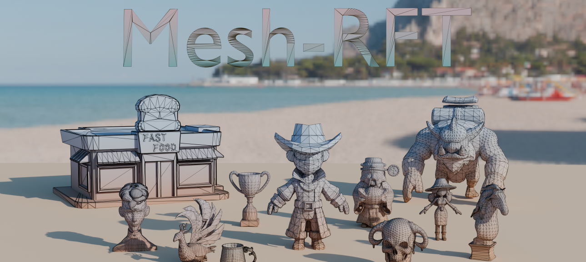 | Mesh-RFT: Enhancing Mesh Generation via Fine-grained Reinforcement Fine-Tuning | arXiv 2025 | [Paper](https://arxiv.org/pdf/2505.16761) |
|  | Scaling mesh generation via compressive tokenization | CVPR 2025 | [Paper](https://arxiv.org/pdf/2411.07025)   [Project](https://whaohan.github.io/bpt/)   [Code](https://github.com/tencent-hunyuan/bpt) |
|  | iFlame: Interleaving Full and Linear Attention for Efficient Mesh Generation | arXiv 2025 | [Paper](https://arxiv.org/pdf/2503.16653)   [Code](https://github.com/hanxiaowang00/iFlame) |
|  | Mesh Silksong: Auto-Regressive Mesh Generation as Weaving Silk | arXiv 2025 | [Paper](https://arxiv.org/pdf/2507.02477) |
|  | MeshPad: Interactive Sketch-Conditioned Artist-Designed Mesh Generation and Editing | arXiv 2025 | [Paper](https://arxiv.org/pdf/2503.01425)   [Project](https://derkleineli.github.io/meshpad/) |
|  | DeepMesh: Auto-Regressive Artist-mesh Creation with Reinforcement Learning | ICCV 2025 | [Paper](https://arxiv.org/pdf/2503.15265)   [Project](https://zhaorw02.github.io/DeepMesh/)   [Code](https://github.com/zhaorw02/DeepMesh) |
|  | EdgeRunner: Auto-regressive Auto-encoder for Artistic Mesh Generation | ICLR 2025 | [Paper](https://arxiv.org/pdf/2409.18114)   [Code](https://github.com/NVlabs/EdgeRunner) |
| 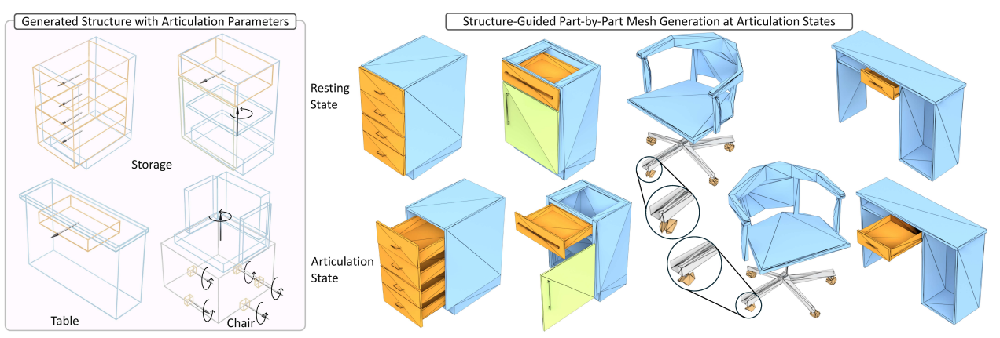 | MeshArt: Generating Articulated Meshes with Structure-guided Transformers | CVPR 2025 | [Paper](https://arxiv.org/pdf/2412.11596)   [Code](https://github.com/DaoyiG/MeshArt) |
|  | TreeMeshGPT: Topology-Aware Mesh Generation with Tree-Structured Graph Priors | CVPR 2025 | [Paper](https://arxiv.org/pdf/2503.11629) |
|  | Meshtron: High-Fidelity, Artist-Like 3D Mesh Generation at Scale | arXiv 2024 | [Paper](https://arxiv.org/pdf/2412.09548)   [Project](https://meshtron.github.io/) |
|  | MeshAnything V2: Artist-Created Mesh Generation With Adjacent Mesh Tokenization | ICCV 2025 | [Paper](https://arxiv.org/pdf/2408.02555)   [Project](https://buaacyw.github.io/meshanything-v2/)   [Code](https://github.com/buaacyw/MeshAnything) |
|  | MeshXL: Neural Coordinate Field for Generative 3D Foundation Models | NeurIPS 2024 | [Paper](https://arxiv.org/pdf/2405.20853)   [Code](https://github.com/OpenMeshLab/MeshXL) |
| 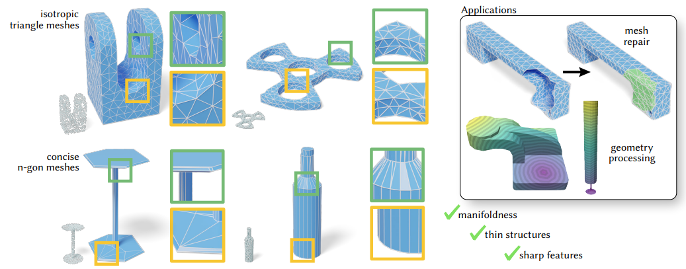 | SpaceMesh: A Continuous Representation for Learning Manifold Surface Meshes | SIGGRAPH Asia 2024 | [Paper](https://arxiv.org/pdf/2409.20562)   [Project](https://research.nvidia.com/labs/toronto-ai/space-mesh/) |
| 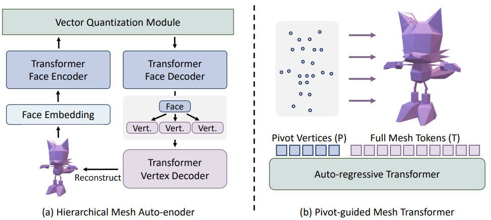 | PivotMesh: Generic 3D Mesh Generation via Pivot Vertices Guidance | ICLR 2025 | [Paper](https://arxiv.org/pdf/2405.16890)   [Project](https://whaohan.github.io/pivotmesh/)   [Code](https://github.com/whaohan/pivotmesh) |
|  | MeshAnything: Artist-Created Mesh Generation with Autoregressive Transformers | ICLR 2025 | [Paper](https://arxiv.org/pdf/2406.10163)   [Project](https://buaacyw.github.io/mesh-anything/)   [Code](https://github.com/buaacyw/MeshAnything) |
| 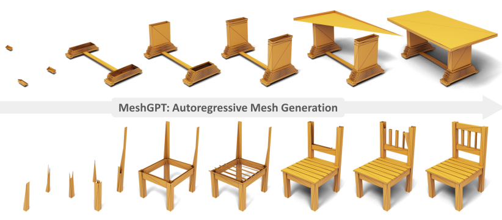 | MeshGPT: Generating Triangle Meshes with Decoder-Only Transformers | CVPR 2024 | [Paper](https://arxiv.org/pdf/2311.15475)   [Code](https://github.com/lucidrains/meshgpt-pytorch) |
|  | PolyDiff: Generating 3D Polygonal Meshes with Diffusion Models | arXiv 2023 | [Paper](https://arxiv.org/pdf/2312.11417) |
|  | PolyGen: An Autoregressive Generative Model of 3D Meshes | ICML 2020 | [Paper](https://arxiv.org/pdf/2002.10880)   [Code](https://github.com/google-deepmind/deepmind-research/tree/master/polygen) |

## Implicit Shape Representations (SDF and Occupancy Fields, etc.)

| Preview | Title | Publication | Links |
|:---:|:---|:---:|:---:|
|  | SparseFlex: High-Resolution and Arbitrary-Topology 3D Shape Modeling (TripoSF) | arXiv 2025 | [Paper](https://arxiv.org/pdf/2503.21732)   [Code](https://github.com/VAST-AI-Research/TripoSF) |
| 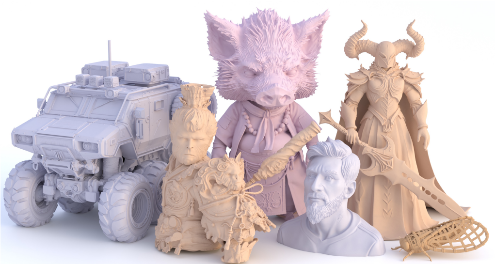 | Ultra3D: Efficient and High-Fidelity 3D Generation with Part Attention | arXiv 2025 | [Paper](https://arxiv.org/pdf/2507.17745.pdf) |
|  | Sparc3D: Sparse Representation and Construction for High-Resolution 3D Shapes Modeling | arXiv 2025 | [Paper](https://arxiv.org/pdf/2505.14521) |
| 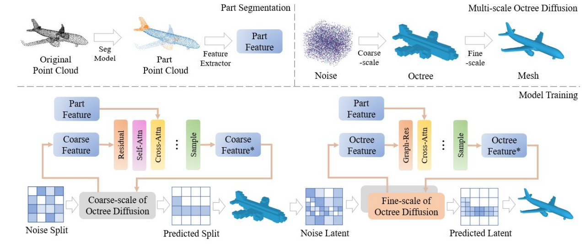 | HierOctFusion: Multi-scale Octree-based 3D Shape Generation via Part-Whole-Hierarchy Message Passing | arXiv 2024 | [Paper](https://arxiv.org/pdf/2508.11106) |
|  | TRELLIS: Structured 3D Latents for Scalable and Versatile 3D Generation | CVPR 2025 | [Paper](https://arxiv.org/pdf/2412.01506)   [Code](https://github.com/microsoft/TRELLIS) |
| 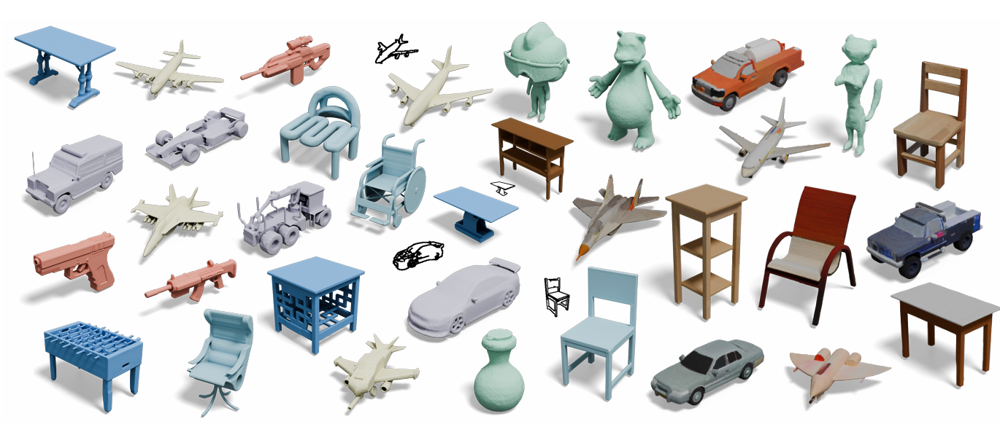 | OctFusion: Octree-based Diffusion Models for 3D Shape Generation | SGP 2025 | [Paper](https://arxiv.org/pdf/2408.14732)   [Code](https://github.com/octree-nn/octfusion) |
|  | LaGeM: A Large Geometry Model for 3D Representation Learning and Diffusion | ICLR 2025 | [Paper](https://arxiv.org/abs/2410.01295)   [Code](https://github.com/1zb/LaGeM)   [Project](https://1zb.github.io/LaGeM/) |
|  | XCube: Large-Scale 3D Generative Modeling using Sparse Voxel Hierarchies | CVPR 2024 | [Paper](https://arxiv.org/pdf/2312.03806)   [Code](https://github.com/nv-tlabs/XCube) |
| 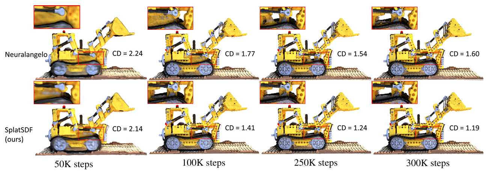 | SplatSDF: Boosting Neural Implicit SDF via Gaussian Splatting Fusion | arXiv 2024 | [Paper](https://arxiv.org/pdf/2411.15468) |
| 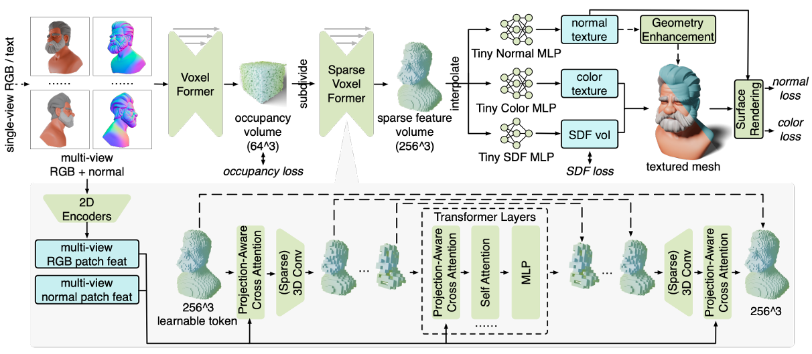 | MeshFormer: High-Quality Mesh Generation with 3D-Guided Reconstruction Model | arXiv 2024 | [Paper](https://arxiv.org/pdf/2408.10198) |
|  | Mosaic-SDF for 3D Generative Models | arXiv 2024 | [Paper](https://arxiv.org/pdf/2312.09222) |
| 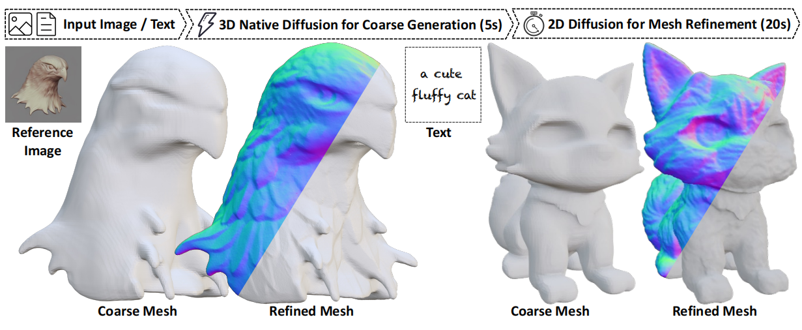 | CraftsMan: High-fidelity Mesh Generation with 3D Native Generation and Interactive Geometry Refiner | arXiv 2024 | [Paper](https://arxiv.org/pdf/2405.14979)   [Code](https://github.com/wyysf-98/CraftsMan3D) |
|  | GSDF: 3DGS Meets SDF for Improved Neural Rendering and Reconstruction | NeurIPS 2024 | [Paper](https://arxiv.org/pdf/2403.16964) |
|  | GEM3D: GEnerative Medial Abstractions for 3D Shape Synthesis | SIGGRAPH 2024 | [Paper](https://arxiv.org/abs/2402.16994)   [Code](https://github.com/lodurality/GEM3D_paper_code)   [Project](https://lodurality.github.io/GEM3D/) |
|  | SurroundSDF: Implicit 3D Scene Understanding Based on Signed Distance Field | CVPR 2024 | [Paper](https://openaccess.thecvf.com/content/CVPR2024/papers/Liu_SurroundSDF_Implicit_3D_Scene_Understanding_Based_on_Signed_Distance_Field_CVPR_2024_paper.pdf) |
|  | HSDF: Hybrid Sign and Distance Field for Neural Representation of Surfaces With Arbitrary Topologies | IEEE 2024 | [Paper](https://ieeexplore.ieee.org/document/10636762/) |
| 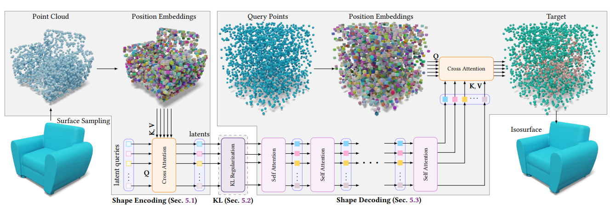 | 3DShape2VecSet: A 3D Shape Representation for Neural Fields and Generative Diffusion Models | ACM TOG 2023 | [Paper](https://arxiv.org/pdf/2301.11445)   [Code](https://github.com/1zb/3DShape2VecSet) |
|  | Locally Attentional SDF Diffusion for Controllable 3D Shape Generation | ACM TOG 2023 | [Paper](https://arxiv.org/pdf/2305.04461) |
| 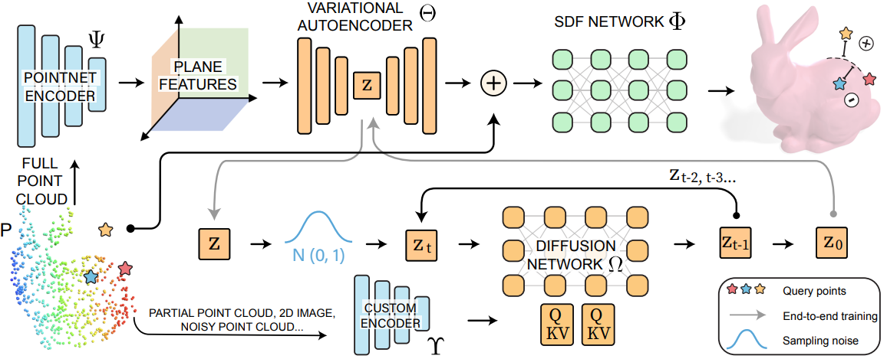 | Diffusion-SDF: Conditional Generative Modeling of Signed Distance Functions | ICCV 2023 | [Paper](https://light.princeton.edu/publication/diffusion-sdf/)   [Project](https://light.princeton.edu/publication/diffusion-sdf/) |
|  | Constructive Solid Geometry on Neural Signed Distance Fields | ACM SIGGRAPH Asia 2023 | [Paper](https://dl.acm.org/doi/fullHtml/10.1145/3610548.3618170)   [Project](https://zoemarschner.com/research/csg_on_neural_sdfs.html) |
| 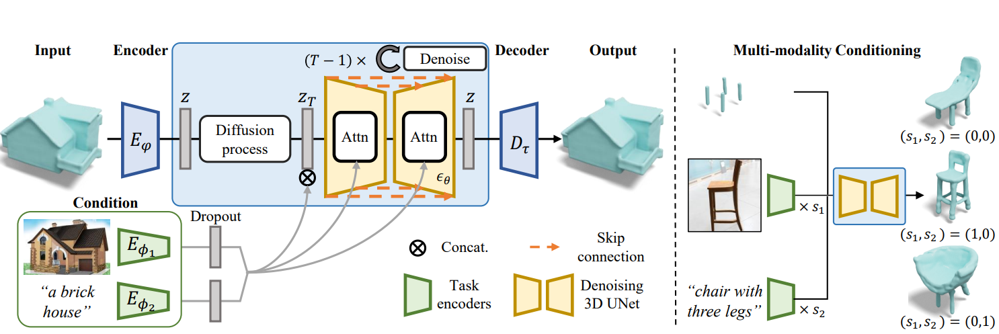 | SDFusion: Multimodal 3D Shape Completion, Reconstruction, and Generation | CVPR 2023 | [Paper](https://yccyenchicheng.github.io/SDFusion/)   [Code](https://github.com/yccyenchicheng/SDFusion) |
|  | SDF-Diffusion: Text-to-Shape via Voxelized Diffusion | CVPR 2023 | [Paper](https://arxiv.org/pdf/2212.03293) |
| 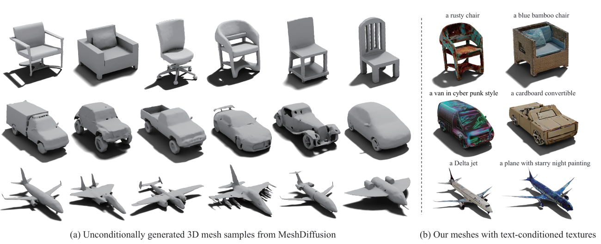 | MeshDiffusion: Score-based Generative 3D Mesh Modeling | ICLR 2023 | [Paper](https://arxiv.org/pdf/2303.08133)   [Code](https://github.com/lzzcd001/MeshDiffusion) |
| 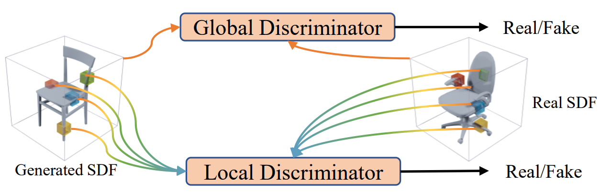 | SDF-StyleGAN: Implicit SDF-Based StyleGAN for 3D Shape Generation | SGP 2022 | [Paper](https://arxiv.org/pdf/2206.12055)   [Code](https://github.com/Zhengxinyang/SDF-StyleGAN) |
|  | Neural Wavelet-domain Diffusion for 3D Shape Generation, Inversion, and Manipulation | SIGGRAPH Asia 2022   ACM TOG | [Paper](https://arxiv.org/abs/2302.00190)   [Code](https://github.com/edward1997104/Wavelet-Generation) |
| 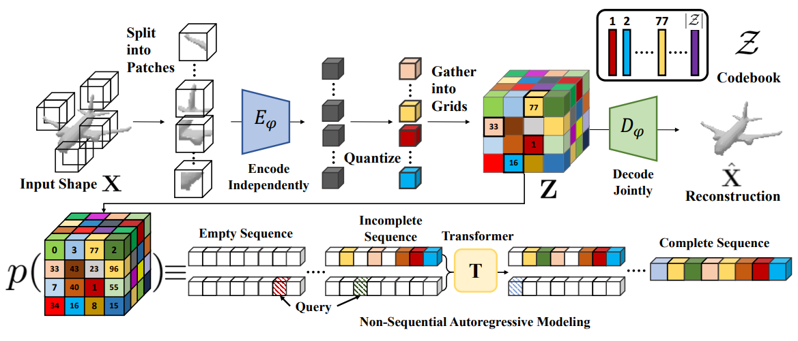 | AutoSDF: Shape Priors for 3D Completion, Reconstruction and Generation | CVPR 2022 | [Paper](https://arxiv.org/pdf/2203.09516) |
|  | 3DILG: Irregular Latent Grids for 3D Generative Modeling | NeurIPS 2022 | [Paper](https://arxiv.org/abs/2205.13914)   [Code](https://github.com/1zb/3DILG)   [Project](https://1zb.github.io/3DILG/) |
|  | NeuS: Learning Neural Implicit Surfaces by Volume Rendering for Multi-view Reconstruction | NeurIPS 2021 | [Paper](https://arxiv.org/pdf/2106.10689)   [Code](https://github.com/Totoro97/NeuS) |
|  | SIREN: Implicit Neural Representations with Periodic Activation Functions | NeurIPS 2020 | [Paper](https://arxiv.org/pdf/2006.09661)   [Code](https://github.com/vsitzmann/siren) |
|  | DeepSDF: Learning Continuous Signed Distance Functions for Shape Representation | CVPR 2019 | [Paper](https://arxiv.org/pdf/1901.05103)   [Code](https://github.com/facebookresearch/DeepSDF) |
|  | Neural Unsigned Distance Fields for Implicit Function Learning | NeurIPS 2020 |  [Paper](https://arxiv.org/pdf/2010.13938) |
| 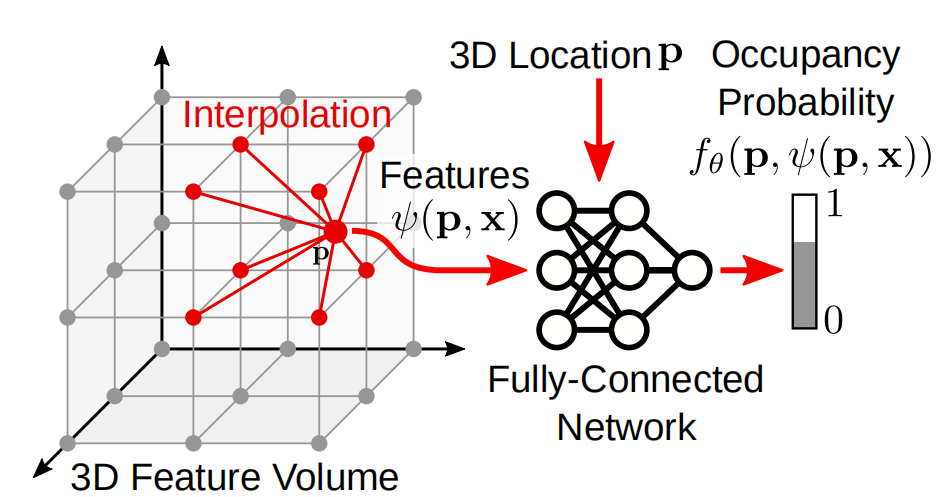 | Convolutional Occupancy Networks | ECCV 2020 | [Paper](https://arxiv.org/pdf/2003.04618)   [Code](https://github.com/autonomousvision/convolutional_occupancy_networks) |
| 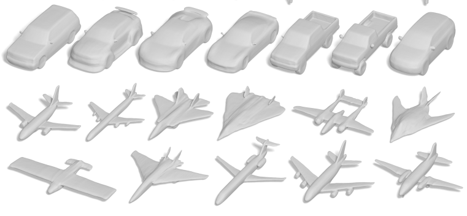 | IM-Net: Learning Implicit Fields for Generative Shape Modeling | CVPR 2019 | [Paper](https://arxiv.org/abs/1812.02822)   [Code](https://github.com/czq142857/implicit-decoder) |

## Point Cloud

| Preview | Title | Publication | Links |
|:---:|:---|:---:|:---:|
|  | TopoDiT-3D: Topology-Aware Diffusion Transformer with Bottleneck Structure for 3D Point Cloud Generation | arXiv 2025 | [Paper](https://arxiv.org/pdf/2505.09140.pdf) |
|  | 3D Point Cloud Generation via Autoregressive Up-sampling | arXiv 2025 | [Paper](https://arxiv.org/pdf/2503.08594.pdf) |
| 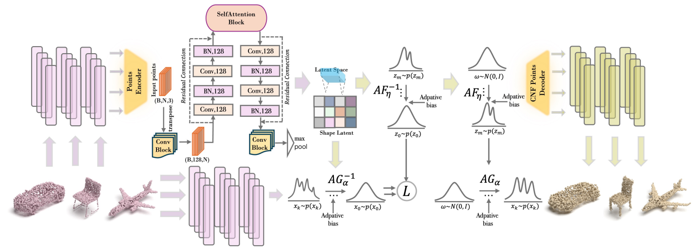 | EAGLE: Contextual Point Cloud Generation via Adaptive Continuous Normalizing Flow with Self-Attention | arXiv 2025 | [Paper](https://arxiv.org/pdf/2503.13479.pdf) |
| 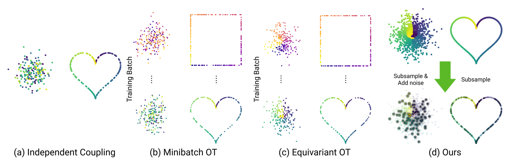 | Not-So-Optimal Transport Flows for 3D Point Cloud Generation | arXiv 2025 | [Paper](https://arxiv.org/pdf/2502.12456.pdf) |
|  | RGB2Point: 3D Point Cloud Generation from Single RGB Images | arXiv 2024 | [Paper](https://arxiv.org/pdf/2407.14979.pdf) |
|  | Fast Training of Diffusion Transformer with Extreme Masking for 3D Point Clouds Generation | ECCV 2024 | [Paper](https://arxiv.org/pdf/2312.07231.pdf) |
|  | Context-Aware Indoor Point Cloud Object Generation through User Instructions | ACM Multimedia 2024 | [Paper](https://arxiv.org/pdf/2311.16501.pdf) |
| 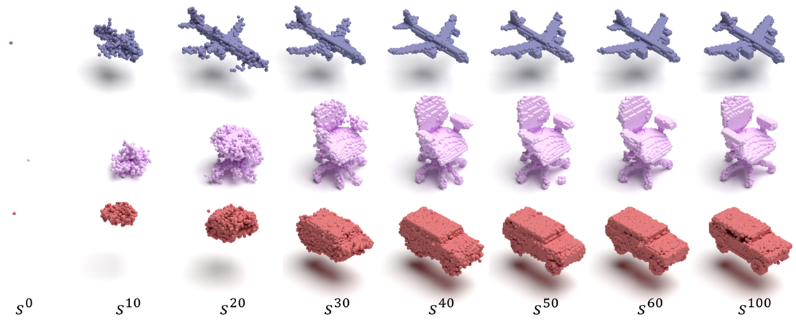 | Learning to Generate 3D Shapes with Generative Cellular Automata | ICLR 2021 | [Paper](https://arxiv.org/pdf/2103.04130) |
|  | 3D Shape Generation and Completion through Point-Voxel Diffusion | ICCV 2021 | [Paper](https://arxiv.org/pdf/2104.03670.pdf)   [Code](https://github.com/alexzhou907/PVD) |

## NeRF

| Preview | Title | Publication | Links |
|:---:|:---|:---:|:---:|
|  | One-2-3-45++: Fast Single Image to 3D Objects with Consistent Multi-View Generation and 3D Diffusion | CVPR 2024 | [Paper](https://arxiv.org/pdf/2311.07885.pdf)   [Project](https://sudo-ai-3d.github.io/One2345plus_page/) |
| 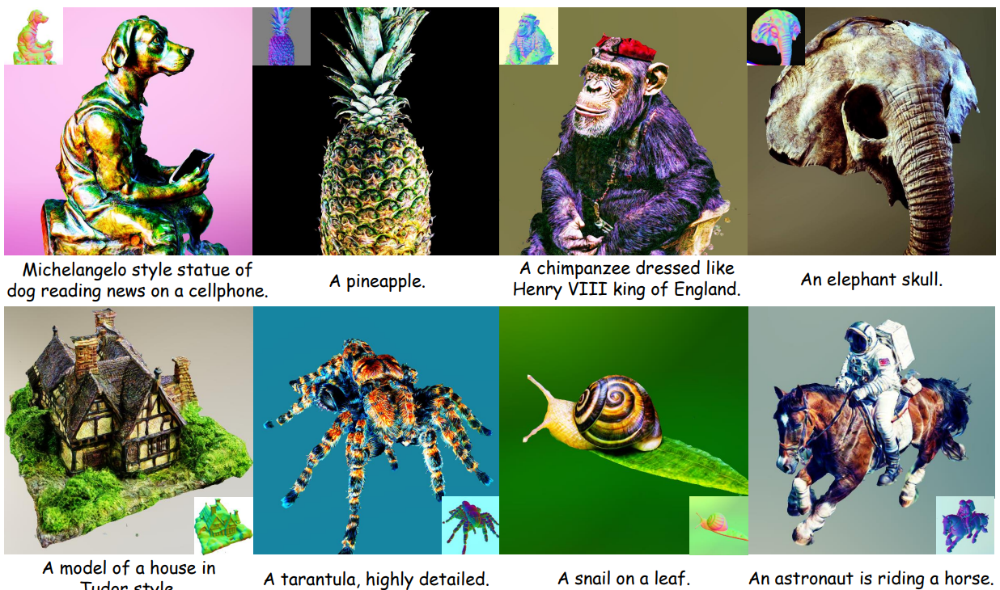 | ProlificDreamer: High-Fidelity and Diverse Text-to-3D Generation with Variational Score Distillation | NeurIPS 2023 | [Paper](https://arxiv.org/pdf/2305.16213.pdf)   [Code](https://github.com/thu-ml/prolificdreamer)   [Project](https://ml.cs.tsinghua.edu.cn/prolificdreamer/) |
|  | One-2-3-45: Any Single Image to 3D Mesh in 45 Seconds without Per-Shape Optimization | NeurIPS 2023 | [Paper](https://arxiv.org/pdf/2306.16928)   [Code](https://github.com/One-2-3-45/One-2-3-45)   [Project](https://one-2-3-45.github.io/) |
|  | Zero-1-to-3: Zero-shot One Image to 3D Object | ICCV 2023 | [Paper](https://arxiv.org/pdf/2303.11328.pdf)   [Code](https://github.com/cvlab-columbia/zero123)   [Project](https://zero123.cs.columbia.edu/) |
|  | Magic3D: High-Resolution Text-to-3D Content Creation | CVPR 2023 | [Paper](https://arxiv.org/pdf/2211.10440.pdf)   [Project](https://research.nvidia.com/labs/dir/magic3d/) |
| 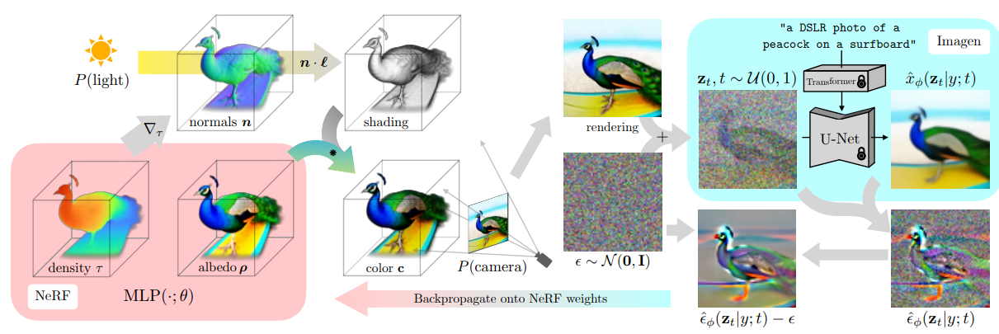 | DreamFusion: Text-to-3D using 2D Diffusion | arXiv 2022 | [Paper](https://arxiv.org/pdf/2209.14988.pdf)   [Project](https://dreamfusion3d.github.io/) |
| 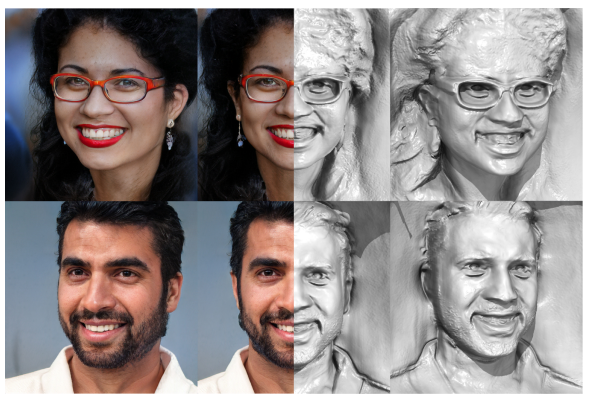 | Efficient Geometry-aware 3D Generative Adversarial Networks | CVPR 2022 | [Paper](https://arxiv.org/pdf/2112.07945.pdf)   [Code](https://github.com/NVlabs/eg3d)   [Project](https://nvlabs.github.io/eg3d/) |

## 3D Gaussian Splatting

| Preview | Title | Publication | Links |
|:---:|:---|:---:|:---:|
|  | VRSplat: Fast and Robust Gaussian Splatting for Virtual Reality | arXiv 2025 | [Paper](https://arxiv.org/pdf/2505.10144) |
|  | Gaussian Splatting with Discretized SDF for Relightable Assets | arXiv 2025 | [Paper](https://arxiv.org/pdf/2507.15629) |
|  | Enhancing 3D Gaussian Splatting Compression via Spatial Condition-based Prediction | arXiv 2025 | [Paper](https://arxiv.org/pdf/2503.23337) |
| 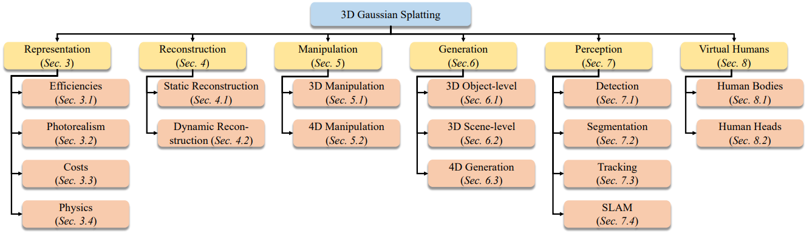 | 3D Gaussian Splatting as a New Era: A Survey | IEEE TVCG 2024 | [Paper](https://ieeexplore.ieee.org/document/10521791/) |
|  | WildGaussians: 3D Gaussian Splatting In the Wild | NeurIPS 2024 | [Paper](https://neurips.cc/virtual/2024/poster/95434) |
|  | Spec-Gaussian: Anisotropic View-Dependent Appearance for 3D Gaussian Splatting | NeurIPS 2024 | [Paper](https://nips.cc/virtual/2024/poster/93509) |
|  | ODGS: 3D Scene Reconstruction from Omnidirectional Images with 3D Gaussian Splattings | NeurIPS 2024 | [Paper](https://arxiv.org/pdf/2410.20686)   [Code](https://github.com/esw0116/ODGS) |
| 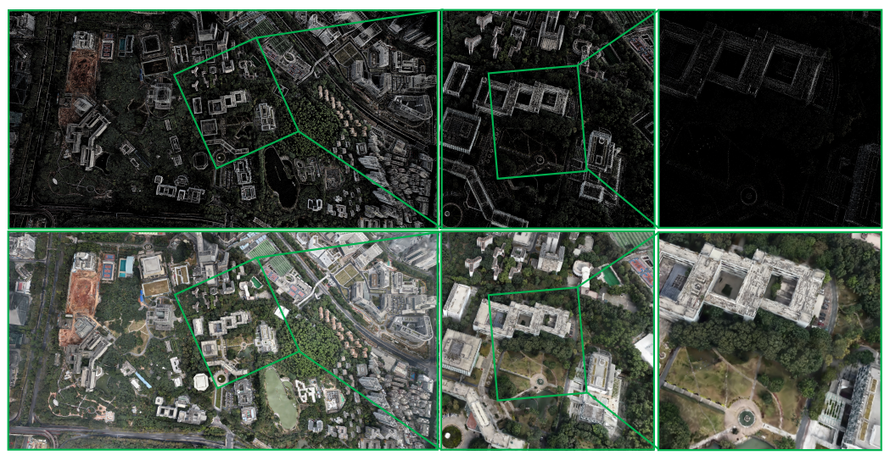 | DOGS: Distributed-Oriented Gaussian Splatting for Large-Scale 3D Reconstruction | NeurIPS 2024 | [Paper](https://arxiv.org/pdf/2405.13943)   [Code](https://github.com/AIBluefisher/DOGS) |
|  | FreeSplat: Generalizable 3D Gaussian Splatting for Free-View Synthesis | NeurIPS 2024 | [Paper](https://arxiv.org/pdf/2405.17958)   [Code](https://github.com/wangys16/FreeSplat) |
| 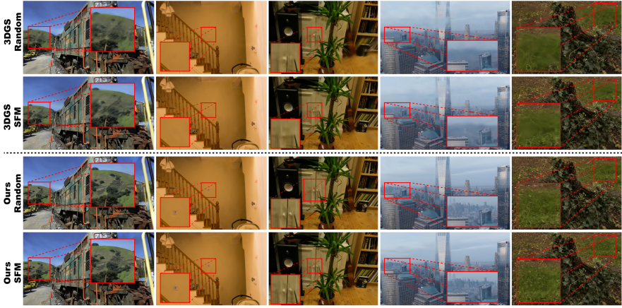 | 3D Gaussian Splatting as Markov Chain Monte Carlo | NeurIPS 2024 (Spotlight) | [Paper](https://arxiv.org/pdf/2404.09591) |
|  | 3iGS: Factorised Tensorial Illumination for 3D Gaussian Splatting | ECCV 2024 | [Paper](https://eccv.ecva.net/virtual/2024/poster/2035) |
|  | HeadStudio: Text to Animatable Head Avatars with 3D Gaussian Splatting | ECCV 2024 | [Paper](https://link.springer.com/chapter/10.1007/978-3-031-73411-3_9) |
| 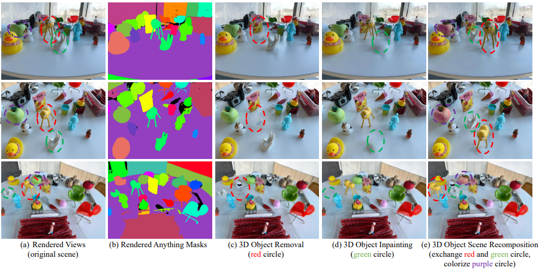 | Gaussian Grouping: Segment and Edit Anything in 3D Scenes | ECCV 2024 | [Paper](https://arxiv.org/pdf/2312.00732)   [Code](https://github.com/lkeab/gaussian-grouping) |
| 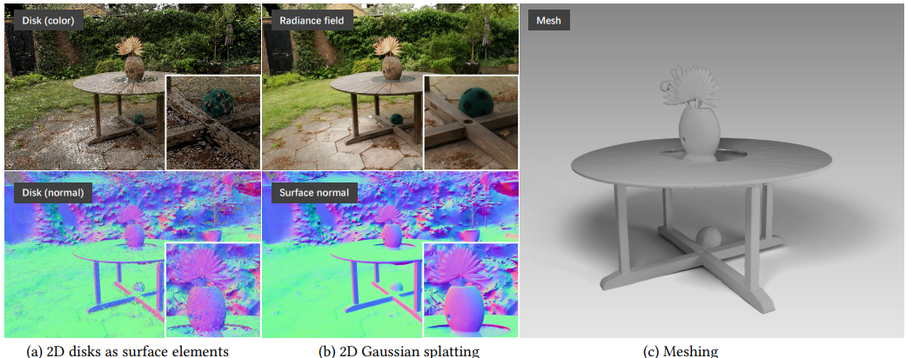 | 2D Gaussian Splatting for Geometrically Accurate Radiance Fields | SIGGRAPH 2024 | [Paper](https://arxiv.org/pdf/2403.17888.pdf)   [Code](https://github.com/hbb1/2d-gaussian-splatting) |
|  | Recent Advances in 3D Gaussian Splatting | arXiv 2024 | [Paper](https://arxiv.org/pdf/2403.11134) |
|  | COLMAP-Free 3D Gaussian Splatting | CVPR 2024 | [Paper](https://openaccess.thecvf.com/content/CVPR2024/papers/Fu_COLMAP-Free_3D_Gaussian_Splatting_CVPR_2024_paper.pdf) |
|  | Gaussian Splatting SLAM | CVPR 2024 (Best Demo) | [Paper](https://openaccess.thecvf.com/content/CVPR2024/html/Matsuki_Gaussian_Splatting_SLAM_CVPR_2024_paper.html) |
|  | Mip-Splatting: Alias-free 3D Gaussian Splatting | CVPR 2024 (Best Student Paper) | [Paper](https://arxiv.org/pdf/2311.16493)   [Code](https://niujinshuchong.github.io/mip-splatting/) |
| 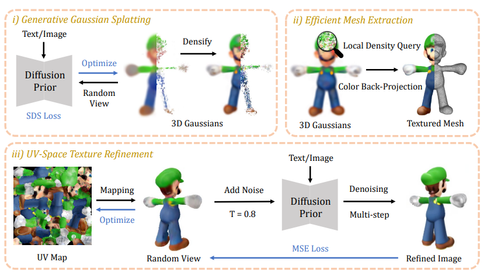 | DreamGaussian: Generative Gaussian Splatting for Efficient 3D Content Creation | ICLR 2024 (Oral) | [Paper](https://arxiv.org/pdf/2309.16653.pdf)   [Code](https://github.com/dreamgaussian/dreamgaussian) |
|  | 3D Gaussian Splatting for Real-Time Radiance Field Rendering | SIGGRAPH 2023 | [Paper](https://arxiv.org/pdf/2308.04079.pdf)   [Code](https://github.com/graphdeco-inria/gaussian-splatting) |
|  | A Survey on 3D Gaussian Splatting | arXiv 2024 | [Paper](https://arxiv.org/pdf/2401.03890) |
| 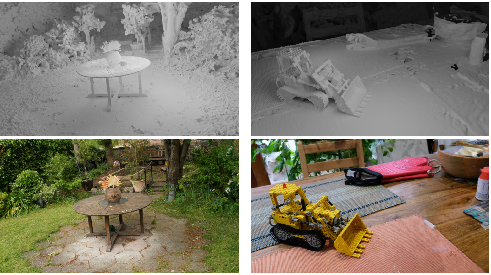 | SuGaR: Surface-Aligned Gaussian Splatting for Efficient 3D Mesh Reconstruction and High-Quality Mesh Rendering | CVPR 2024 | [Paper](https://github.com/Anttwo/SuGaR)   [Code](https://github.com/Anttwo/SuGaR) |

## CAD

| Preview | Title | Publication | Links |
|:---:|:---|:---:|:---:|
| 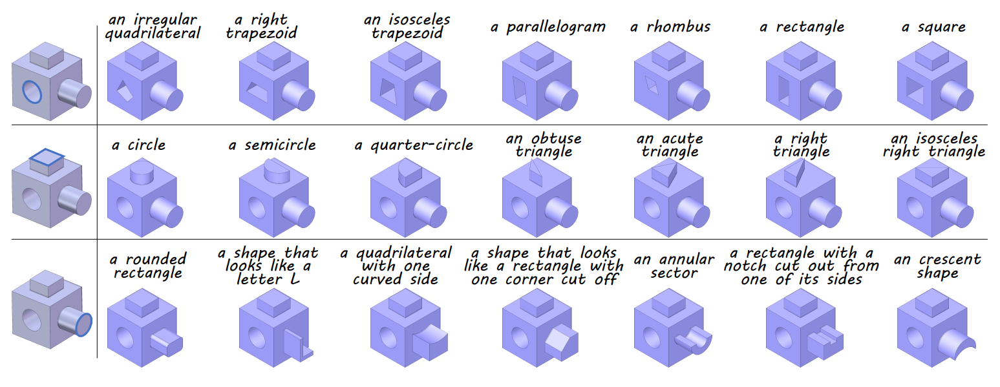 | GeoCAD: Local Geometry-Controllable CAD Generation | arXiv 2025 | [Paper](https://arxiv.org/pdf/2506.10337) |
|  | CAD-Coder: Text-to-CAD Generation with Chain-of-Thought and Geometric Reward | arXiv 2025 | [Paper](https://arxiv.org/pdf/2505.19713) |
|  | Stitch-A-Shape: Bottom-up Learning for B-Rep Generation | SIGGRAPH 2025 | [Paper](https://dl.acm.org/doi/pdf/10.1145/3721238.3730661) |
|  | BrepDiff: Single-stage B-rep Diffusion Model | SIGGRAPH 2025 | [Paper](https://dl.acm.org/doi/pdf/10.1145/3721238.3730698)   [Project](https://brepdiff.github.io/) |
|  | HoLa: B-Rep Generation using a Holistic Latent Representation | SIGGRAPH 2025 | [Paper](https://arxiv.org/abs/2504.14257)   [Project](https://vcc.tech/research/2025/HolaBRep) |
|  | CLR-Wire: Towards Continuous Latent Representations for 3D Curve Wireframe Generation | SIGGRAPH 2025 | [Paper](https://arxiv.org/pdf/2504.19174)   [Code](https://github.com/qixuema/CLR-Wire) |
|  | DTGBrepGen: A Novel B-rep Generative Model through Decoupling Topology and Geometry | CVPR 2025 | [Paper](https://arxiv.org/pdf/2503.13110)   [Code](https://github.com/jinli99/DTGBrepGen)   [Project](https://jinli99.github.io/DTGBrepGen/) |
|  | CADCrafter: Generating Computer-Aided Design Models from Unconstrained Images | CVPR 2025 | [Paper](https://arxiv.org/pdf/2504.04753)|
| 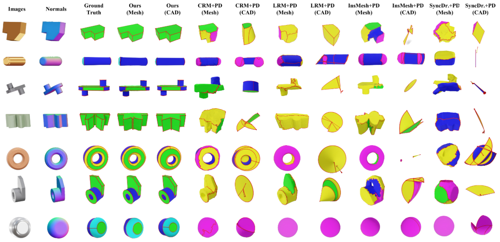 | CADDreamer: CAD object Generation from Single-view Images | CVPR 2025 | [Paper](https://arxiv.org/pdf/2502.20732)   [Project](https://lidan233.github.io/caddreamer/) |
|  | CAD-GPT: Synthesising CAD Construction Sequence with Spatial Reasoning-Enhanced Multimodal LLMs | arXiv 2025 | [Paper](https://arxiv.org/pdf/2412.19663)   [Project](https://openiwin.github.io/CAD-GPT/) |
|  | Text-to-CAD Generation Through Infusing Visual Feedback in Large Language Models | arXiv 2025 | [Paper](https://arxiv.org/pdf/2501.19054) |
|  | Revisiting CAD Model Generation by Learning Raster Sketch | AAAI 2025 | [Paper](https://www.arxiv.org/pdf/2503.00928)     [Dataset](https://github.com/BunnySoCrazy/RECAD)|
|  | FlexCAD: Unified and Versatile Controllable CAD Generation with Fine-tuned Large Language Models | ICLR 2025 | [Paper](https://arxiv.org/pdf/2411.05823)    [Code](https://github.com/microsoft/FlexCAD) |
|  | Generating CAD Code with Vision-Language Models for 3D Designs | ICLR 2025 | [Paper](https://arxiv.org/pdf/2410.05340)    [Code](https://github.com/Kamel773/CAD_Code_Generation) |
|  | Don’t Mesh with Me: Generating Constructive Solid Geometry Instead of Meshes by Fine-Tuning a Code-Generation LLM | arXiv 2024 | [Paper](https://arxiv.org/pdf/2411.15279) |
| 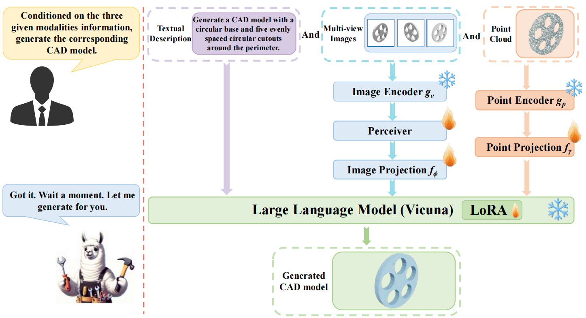 | CAD-MLLM: Unifying Multimodality-Conditioned CAD Generation With MLLM | arXiv 2024 | [Paper](https://arxiv.org/pdf/2411.04954)   [Project](https://cad-mllm.github.io/) |
| 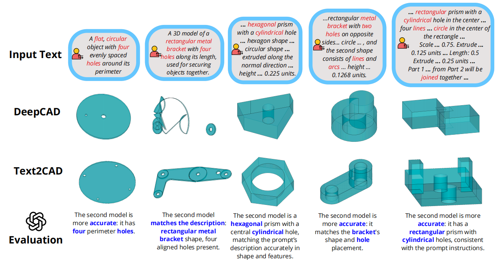 | Text2CAD: Text to 3D CAD Generation via Technical Drawings | NeurIPS 2024 | [Paper](https://arxiv.org/pdf/2411.06206)   [Code](https://github.com/SadilKhan/Text2CAD)   [Project](https://sadilkhan.github.io/text2cad-project/) |
|  | CadVLM: Bridging Language and Vision in the Generation of Parametric CAD Sketches | ECCV 2024 | [Paper](https://arxiv.org/pdf/2409.17457)|
| 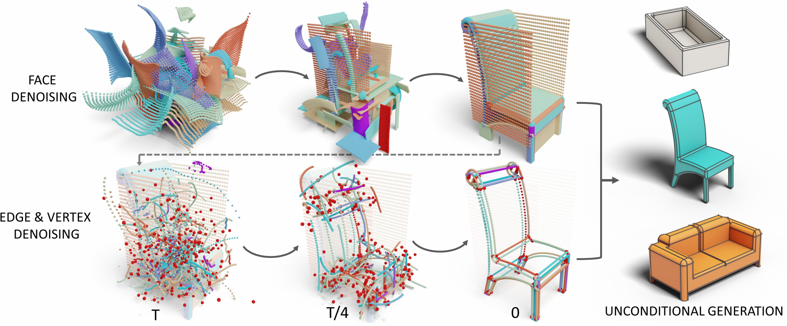 | BrepGen: A B-rep Generative Diffusion Model with Structured Latent Geometry | SIGGRAPH 2024 | [Paper](https://arxiv.org/pdf/2401.15563)   [Code](https://github.com/samxuxiang/BrepGen) |
|  | Learn to Create Simple LEGO Micro Buildings | SIGGRAPH Asia 2024 | [Paper](https://dlnext.acm.org/doi/pdf/10.1145/3687755)   [Code](https://github.com/Occulte/LEGO_Buildings_Generation) |
|  | Generating 3D House Wireframes with Semantics | ECCV 2024 | [Paper](https://arxiv.org/pdf/2407.12267)   [Project](https://vcc.tech/research/2024/3DWire) |
|  | SolidGen: An Autoregressive Model for Direct B-rep Synthesis | ICLR 2024 | [Paper](https://openreview.net/pdf?id=ZR2CDgADRo) |
| 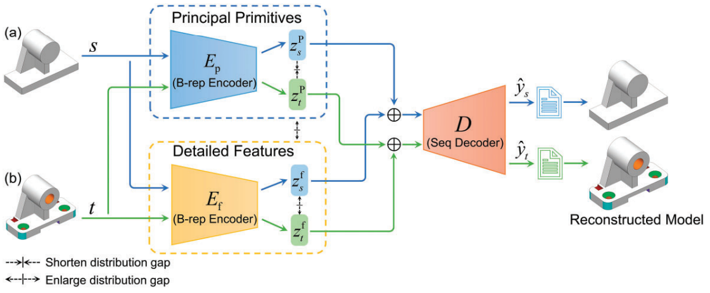 | Brep2Seq: A Dataset and Hierarchical Deep Learning Network for Reconstruction and Generation of Computer-Aided Design Models | JCDE 2024 | [Paper](https://academic.oup.com/jcde/article/11/1/110/7582276)    [Code](https://github.com/zhangshuming0668/Brep2Seq) |
|  | VQ-CAD: Computer-Aided Design model generation with vector quantized diffusion | CAGD 2024 | [Paper](https://www.sciencedirect.com/science/article/pii/S016783962400061X) |
|  | PartNeRF: Generating Part-Aware Editable 3D Shapes without 3D Supervision | CVPR 2023 | [Paper](https://arxiv.org/pdf/2303.09554)   [Code](https://github.com/ktertikas/part_nerf)    [Project](https://ktertikas.github.io/part_nerf) |
|  | Hierarchical Neural Coding for Controllable CAD Model Generation | ICML 2023 | [Paper](https://arxiv.org/pdf/2307.00149)   [Code](https://github.com/samxuxiang/hnc-cad)   [Project](https://hnc-cad.github.io/) |
|  | SkexGen: Autoregressive Generation of CAD Construction Sequences with Disentangled Codebooks | ICML 2022 | [Paper](https://arxiv.org/pdf/2207.04632)   [Code](https://github.com/samxuxiang/SkexGen)   [Project](https://samxuxiang.github.io/skexgen) |
|  | Free2CAD: Parsing Freehand Drawings into CAD Commands | SIGGRAPH 2022 |   [Code](https://github.com/Enigma-li/Free2CAD)   [Project](https://geometry.cs.ucl.ac.uk/projects/2022/free2cad/) |
|  | DeepCAD: A Deep Generative Network for Computer-Aided Design Models | ICCV 2021| [Paper](https://arxiv.org/pdf/2105.09492)   [Code](https://github.com/ChrisWu1997/DeepCAD)   [Project](http://www.cs.columbia.edu/cg/deepcad/) |
|  | Roof-GAN: Learning to Generate Roof Geometry and Relations for Residential Houses | CVPR 2021 | [Paper](https://arxiv.org/pdf/2012.09340)    [Code](https://github.com/yi-ming-qian/roofgan) |
|  | Computer-aided design as language | NeurIPS 2021 | [Paper](https://arxiv.org/pdf/2105.02769)|
|  | SDM-NET: Deep Generative Network for Structured Deformable Mesh | TOG 2019 | [Paper](https://dl.acm.org/doi/pdf/10.1145/3355089.3356488)   [Code](https://github.com/gaolinorange/SDMNET_stamp) |
|  | StructureNet: Hierarchical Graph Networks for 3D Shape Generation | Siggraph Asia 2019 | [Paper](https://arxiv.org/pdf/1908.00575)   [Code](https://github.com/daerduoCarey/structurenet)   [Project](https://cs.stanford.edu/~kaichun/structurenet/) |
|  | AtlasNet: A Papier-Mâché Approach to Learning 3D Surface Generation | CVPR 2018 | [Paper](https://arxiv.org/pdf/1802.05384)   [Code](https://github.com/ThibaultGROUEIX/AtlasNet)   [Project](https://imagine.enpc.fr/~groueixt/atlasnet/) |

## Voxel

| Preview | Title | Publication | Links |
|:---:|:---|:---:|:---:|
| 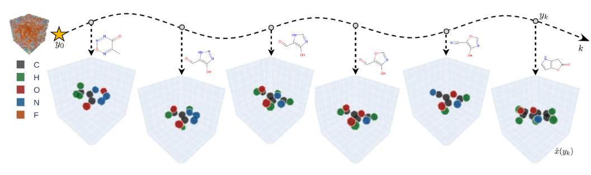 | 3D molecule generation by denoising voxel grids | NeurIPS 2023 | [Paper](https://arxiv.org/pdf/2306.07473.pdf) |
|  | AutoSDF: Shape Priors for 3D Completion, Reconstruction and Generation | CVPR 2022 | [Paper](https://arxiv.org/pdf/2203.09516.pdf)   [Code](https://github.com/yccyenchicheng/AutoSDF)   [Project](https://yccyenchicheng.github.io/AutoSDF/) |
|  | Octree Transformer: Autoregressive 3D Shape Generation on Hierarchically Structured Sequences | arXiv 2021 | [Paper](https://arxiv.org/pdf/2111.12480.pdf) |
| 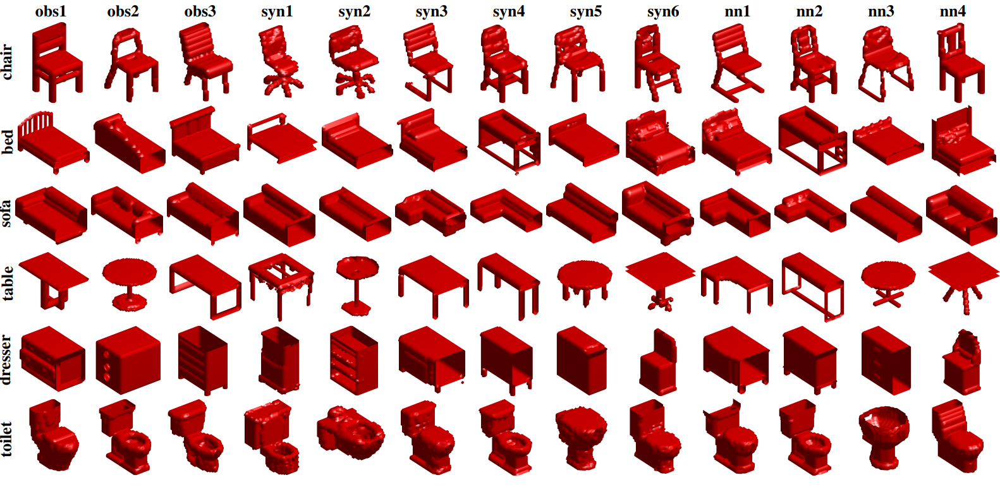 | Generative VoxelNet: Learning Energy-Based Models for 3D Shape Synthesis and Analysis | TPAMI 2020 | [Paper](http://www.stat.ucla.edu/~jxie/3DDescriptorNet/3DDescriptorNet_file/doc/3DDescriptorNet.pdf)   [Code](https://github.com/jianwen-xie/3DDescriptorNet)   [Project](http://www.stat.ucla.edu/~jxie/3DDescriptorNet/3DDescriptorNet.html) |
| 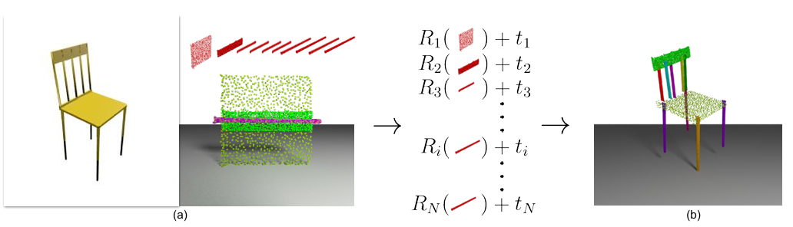 | Learning Part Generation and Assembly for Structure-Aware Shape Synthesis | AAAI 2020 | [Paper](https://arxiv.org/pdf/1906.06693.pdf) |
| 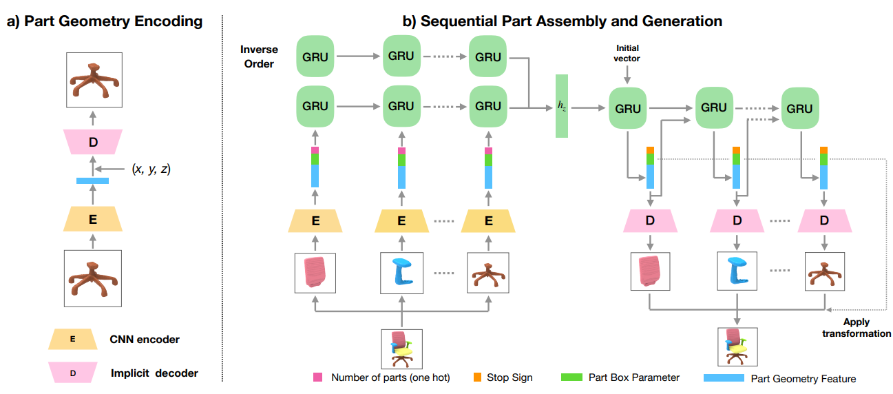 | PQ-NET: A Generative Part Seq2Seq Network for 3D Shapes | CVPR 2020 | [Paper](https://arxiv.org/pdf/1911.10949.pdf)   [Code](https://github.com/ChrisWu1997/PQ-NET) |
|  | Generalized Autoencoder for Volumetric Shape Generation | CVPRW 2020 | [Paper](https://openaccess.thecvf.com/content_CVPRW_2020/papers/w17/Guan_Generalized_Autoencoder_for_Volumetric_Shape_Generation_CVPRW_2020_paper.pdf)   [Code](https://github.com/IsaacGuan/3D-GAE) |
| 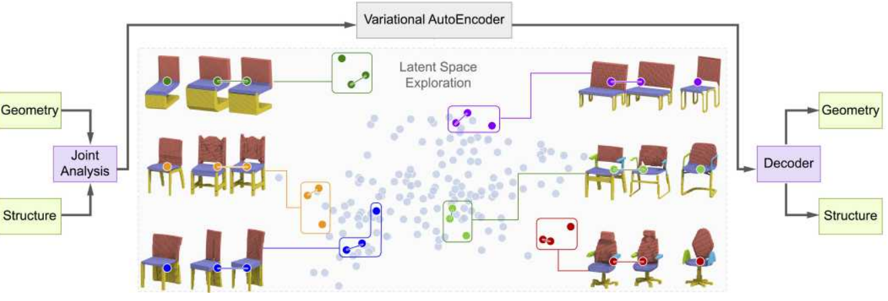 | SAGNet: Structure-aware Generative Network for 3D-Shape Modeling | SIGGRAPH 2019 | [Paper](https://dilincv.github.io/papers/SAGNet_sig2019.pdf)   [Code](https://github.com/zhijieW94/SAGNet)   [Project](https://vcc.tech/research/2019/SAGnet/) |
|  | Generative and Discriminative Voxel Modeling with Convolutional Neural Networks | arXiv 2016 | [Paper](https://arxiv.org/pdf/1608.04236.pdf)   [Code](https://github.com/ajbrock/Generative-and-Discriminative-Voxel-Modeling) |
| 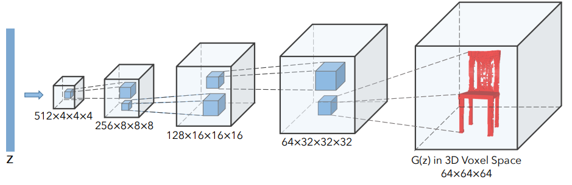 | Learning a Probabilistic Latent Space of Object Shapes via 3D Generative-Adversarial Modeling | NeurIPS 2016 | [Paper](https://arxiv.org/pdf/1610.07584.pdf)   [Code](https://github.com/zck119/3dgan-release)   [Project](http://3dgan.csail.mit.edu/) |

## Part-based 3D

| Preview | Title | Publication | Links |
|:---:|:---|:---:|:---:|
|  | PartNeXt: A Next-Generation Dataset for Fine-Grained and Hierarchical 3D Part Understanding | arXiv 2025 | [Paper](https://arxiv.org/pdf/2510.20155) |
|  | FullPart: Generating each 3D Part at Full Resolution | arXiv 2025 | [Paper](https://arxiv.org/pdf/2510.26140) |
|  | BANG: Dividing 3D Assets via Generative Exploded Dynamics | arXiv 2025 | [Paper](https://arxiv.org/pdf/2507.21493) |
| 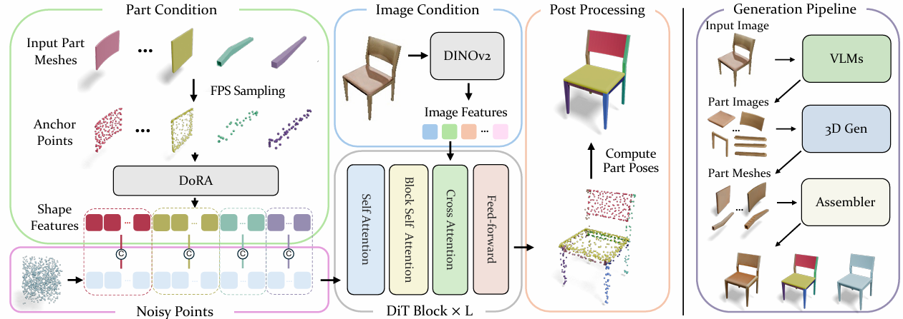 | Assembler: Scalable 3D Part Assembly via Anchor Point Diffusion | arXiv 2025 | [Paper](https://arxiv.org/pdf/2506.17074) |
|  | Efficient Part-level 3D Object Generation via Dual Volume Packing | arXiv 2025 | [Paper](https://arxiv.org/pdf/2506.09980) |
|  | MeshArt: Generating Articulated Meshes with Structure-guided Transformers | CVPR 2025 | [Paper](https://arxiv.org/pdf/2412.11596)   [Code](https://github.com/DaoyiG/MeshArt) |
|  | PrimitiveAnything: Human-Crafted 3D Primitive Assembly Generation with Auto-Regressive Transformer | SIGGRAPH 2025 | [Paper](https://arxiv.org/pdf/2505.04622)   [Code](https://github.com/PrimitiveAnything/PrimitiveAnything) |
|  | OmniPart: Part-Aware 3D Generation with Semantic Decoupling and Structural Cohesion | arXiv 2025 | [Paper](https://arxiv.org/pdf/2507.06165) |
|  | PartCrafter: Structured 3D Mesh Generation via Compositional Latent Diffusion Transformers | arXiv 2025 | [Paper](https://arxiv.org/pdf/2506.05573) |
| 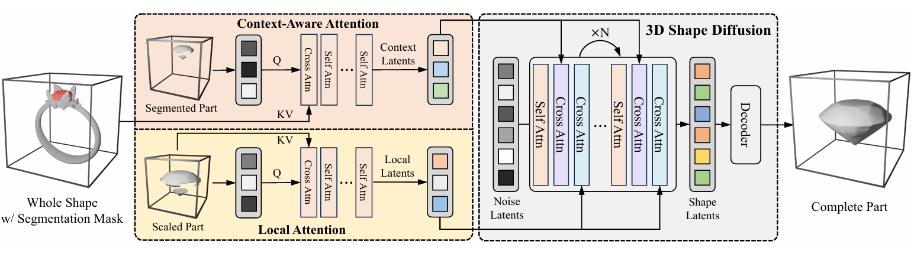 | HoloPart: Generative 3D Part Amodal Segmentation | arXiv 2025 | [Paper](https://arxiv.org/pdf/2504.07943)   [Code](https://github.com/VAST-AI-Research/HoloPart) |
| 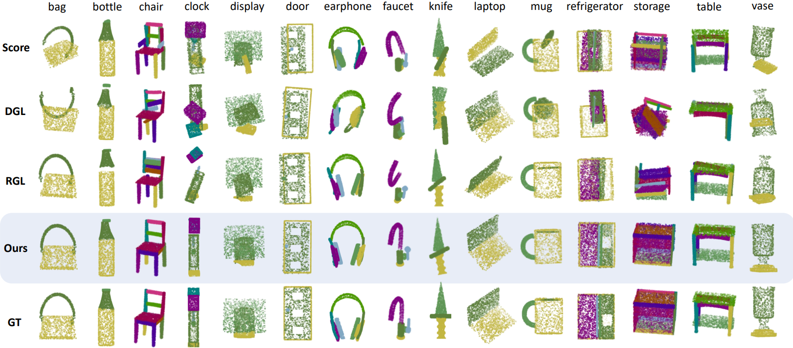 | SPAFormer: Sequential 3D Part Assembly with Transformers | 3DV 2025 | [Paper](https://arxiv.org/pdf/2403.05874)   [Code](https://github.com/xuboshen/SPAFormer) |
| 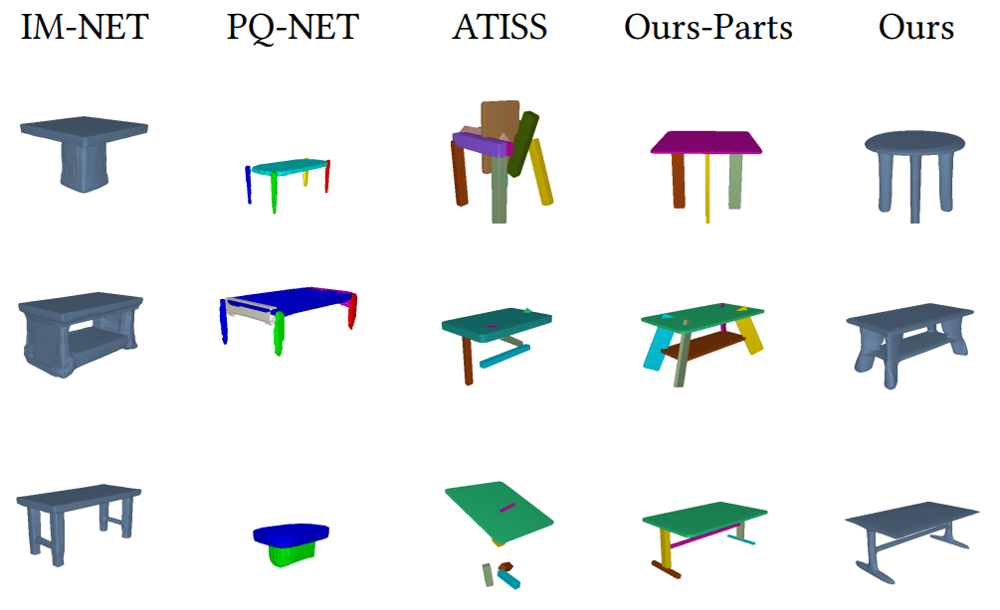 | PASTA: Controllable Part-Aware Shape Generation with Autoregressive Transformers | arXiv 2024 | [Paper](https://arxiv.org/pdf/2407.13677) |
| 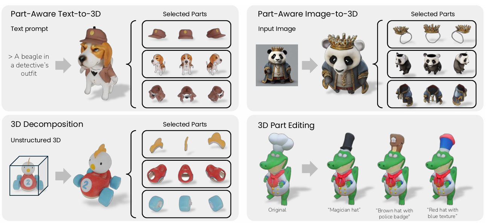 | PartGen: Part-level 3D Generation and Reconstruction with Multi-View Diffusion Models | arXiv 2024 | [Paper](https://arxiv.org/pdf/2412.18608)   [Project](https://silent-chen.github.io/PartGen/) |
| 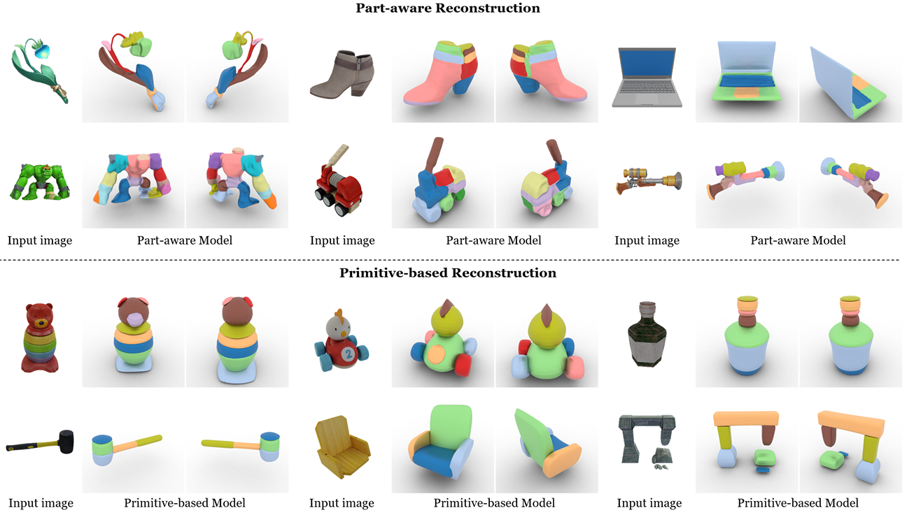 | Part123: Part-aware 3D Reconstruction from a Single-view Image | SIGGRAPH 2024 | [Paper](https://arxiv.org/pdf/2405.16888)   [Project](https://liuar0512.github.io/part123_official_page/) |
|  | DAE-Net: Deforming Auto-Encoder for fine-grained shape co-segmentation | SIGGRAPH 2024 | [Paper](https://arxiv.org/pdf/2311.13125)   [Code](https://github.com/czq142857/DAE-Net) |
|  | StructureNet: Hierarchical Graph Networks for 3D Shape Generation | SIGGRAPH Asia 2019 | [Paper](https://arxiv.org/pdf/1908.00575)   [Code](https://github.com/daerduoCarey/structurenet) |
|  | PartNet: A Large-scale Benchmark for Fine-grained and Hierarchical Part-level 3D Object Understanding | CVPR 2019 | [Paper](https://arxiv.org/pdf/1812.02713) [Dataset](https://partnet.cs.stanford.edu/) |
| 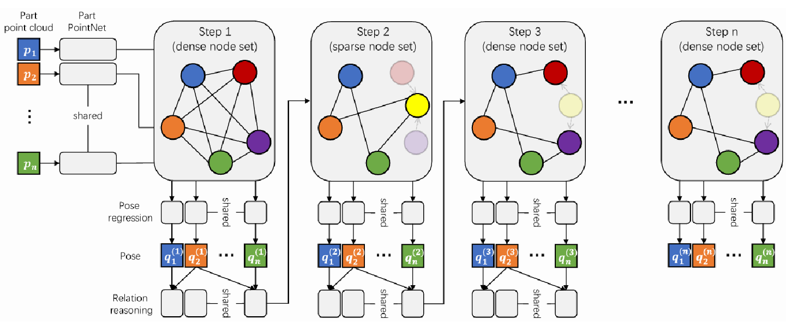 | Generative 3D Part Assembly via Dynamic Graph Learning | NeurIPS 2020 | [Paper](https://arxiv.org/pdf/2006.07793)   [Code](https://github.com/hyperplane-lab/Generative-3D-Part-Assembly) |
| 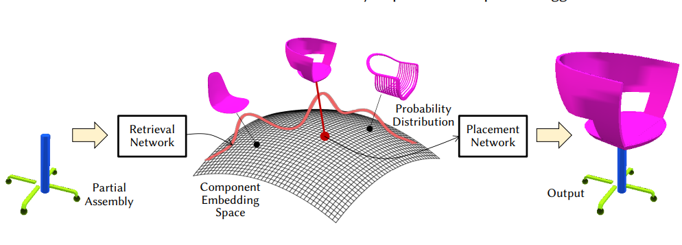 | ComplementMe: Weakly-Supervised Component Suggestions for 3D Modeling | SIGGRAPH Asia 2017 | [Paper](https://arxiv.org/pdf/1708.01841) |
|  | BSP-Net: Generating Compact Meshes via Binary Space Partitioning | CVPR 2020 | [Paper](https://arxiv.org/pdf/1911.06971)   [Code](https://github.com/czq142857/BSP-NET-pytorch) |
| 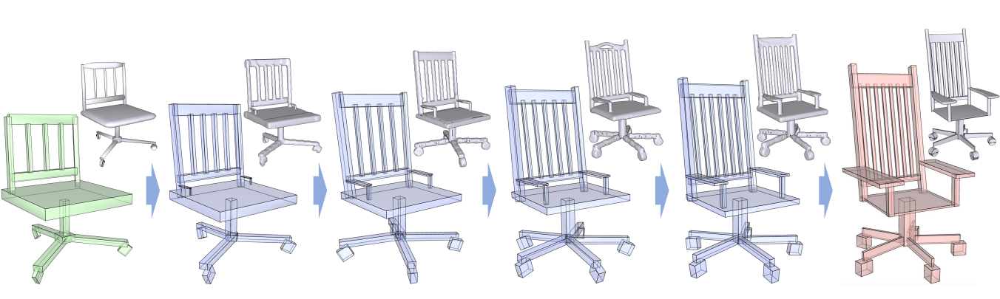 | GRASS: Generative Recursive Autoencoders for Shape Structures | SIGGRAPH 2017 | [Paper](https://arxiv.org/pdf/1705.02090) |
| 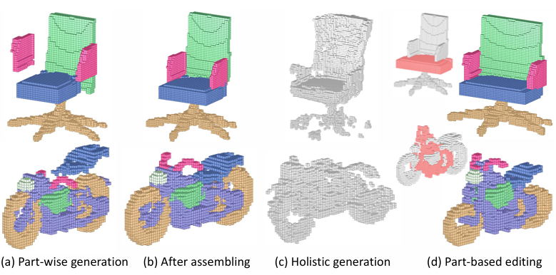 | Learning Part Generation and Assembly for Structure-Aware Shape Synthesis | AAAI 2020 | [Paper](https://arxiv.org/pdf/1906.06693) |
|  | Learning 3D Part Assembly from a Single Image | ECCV 2020 | [Paper](https://arxiv.org/pdf/2003.09754) |
|  | CompoNet: Learning to Generate the Unseen by Part Synthesis and Composition | ICCV 2019 | [Paper](https://arxiv.org/pdf/1811.07441) |
|  | ShapeAssembly: Learning to Generate Programs for 3D Shape Structure Synthesis | SIGGRAPH Asia 2020 | [Paper](https://arxiv.org/pdf/2009.08026)   [Code](https://github.com/rkjones4/ShapeAssembly) |
|  | Part-based 3D Object Reconstruction from a Single RGB Image | arXiv 2021 | [Paper](https://arxiv.org/pdf/2111.10180) |
|  | PartSLIP: Low-shot Part Segmentation for 3D Point Clouds via Pretrained Image-Language Models | CVPR 2023 | [Paper](https://arxiv.org/pdf/2212.01558)   [Code](https://github.com/colin97/PartSLIP) |
|  | Unsupervised Learning of Shape Programs with Repeatable Implicit Parts | NeurIPS 2022 | [Paper](https://papers.nips.cc/paper_files/paper/2022/hash/f6adf61977467560f79b95485d1f3a79-Abstract-Conference.html)   [Project](https://progrip-project.github.io/) |
|  | SPAGHETTI: Editing Implicit Shapes Through Part Aware Generation | ACM TOG 2022 | [Paper](https://arxiv.org/pdf/2201.13168)   [Code](https://github.com/amirhertz/spaghetti)   [Project](https://amirhertz.github.io/spaghetti/) |
| 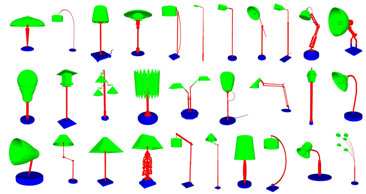 | BAE-NET: Branched Autoencoder for Shape Co-Segmentation | ICCV 2019 | [Paper](https://openaccess.thecvf.com/content_ICCV_2019/papers/Chen_BAE-NET_Branched_Autoencoder_for_Shape_Co-Segmentation_ICCV_2019_paper.pdf)   [Code](https://github.com/czq142857/BAE-NET) |

## Others (Not yet classified)
|                                   Preview                                  | Title                                                                                                | Publication |                   Links                   |
| :------------------------------------------------------------------------: | :--------------------------------------------------------------------------------------------------- | :---------: | :---------------------------------------: |
| 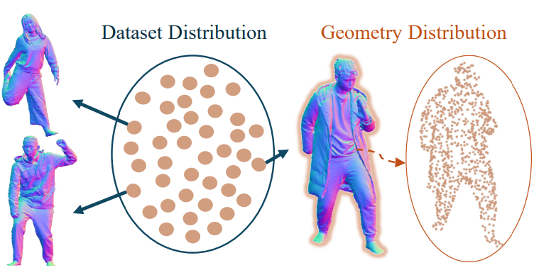 | Generative Human Geometry Distribution                                                               |  Arxiv 2025 | [Paper](https://arxiv.org/pdf/2503.01448) |
|                | Geometry Distributions                                                                               |  ICCV 2025  | [Paper](https://arxiv.org/pdf/2411.16076) |
| 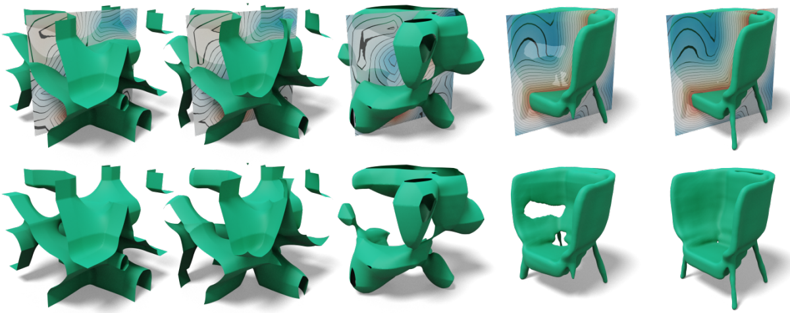 | Functional Diffusion | CVPR 2024 | [Paper](https://arxiv.org/abs/2311.15435)   [Code](https://github.com/1zb/functional-diffusion)   [Project](https://1zb.github.io/functional-diffusion/) |
|                            | 3DTopia-XL: Scaling High-quality 3D Asset Generation via Primitive Diffusion                         |  Arxiv 2024 | [Paper](https://arxiv.org/pdf/2409.12957) |
|               | Geometry Image Diffusion: Fast and Data-Efficient Text-to-3D with Image-Based Surface Representation |  Arxiv 2024 | [Paper](https://arxiv.org/pdf/2409.03718) |
|      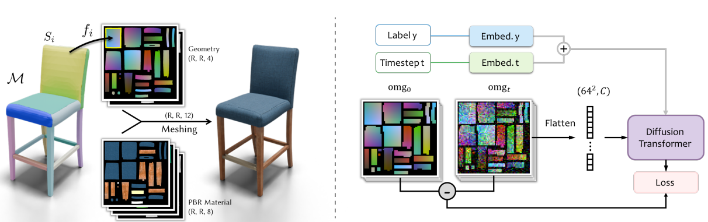     | An Object is Worth 64√ó64 Pixels: Generating 3D Object via Image Diffusion                            |  Arxiv 2024 | [Paper](https://arxiv.org/pdf/2408.03178) |
|                                 | X-Ray: A Sequential 3D Representation for Generation                                                 |  Arxiv 2024 | [Paper](https://arxiv.org/pdf/2404.14329) |
|  | MeshCNN: A Network with an Edge | SIGGRAPH 2019 | [Paper](https://arxiv.org/pdf/1809.05910)   [Code](https://github.com/ranahanocka/MeshCNN) |
| 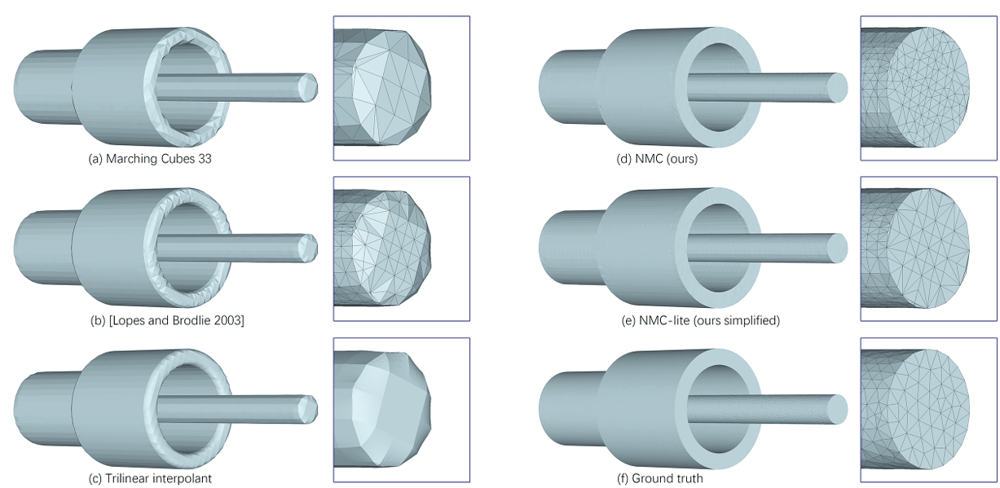 | Neural Marching Cubes | SIGGRAPH Asia 2021 | [Paper](https://arxiv.org/pdf/2106.11272)    [Code](https://github.com/czq142857/NMC) |
| 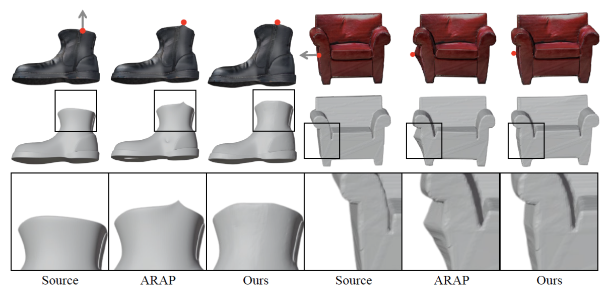 | As-Plausible-As-Possible: Plausibility-Aware Mesh Deformation Using 2D Diffusion Priors | CVPR 2024 |   [Project](https://visualai.kaist.ac.kr/) |
| 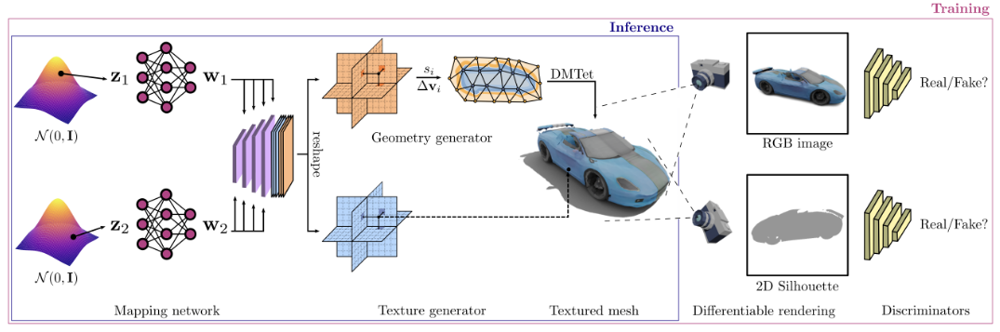 | GET3D: A Generative Model of High Quality 3D Textured Shapes Learned from Images | NeurIPS 2022 | [Paper](https://research.nvidia.com/labs/toronto-ai/GET3D/)   [Code](https://github.com/nv-tlabs/GET3D) |
|  | Single Mesh Diffusion Models with Field Latents for Texture Generation | arXiv 2023 | [Paper](https://arxiv.org/pdf/2312.09250) |

---
